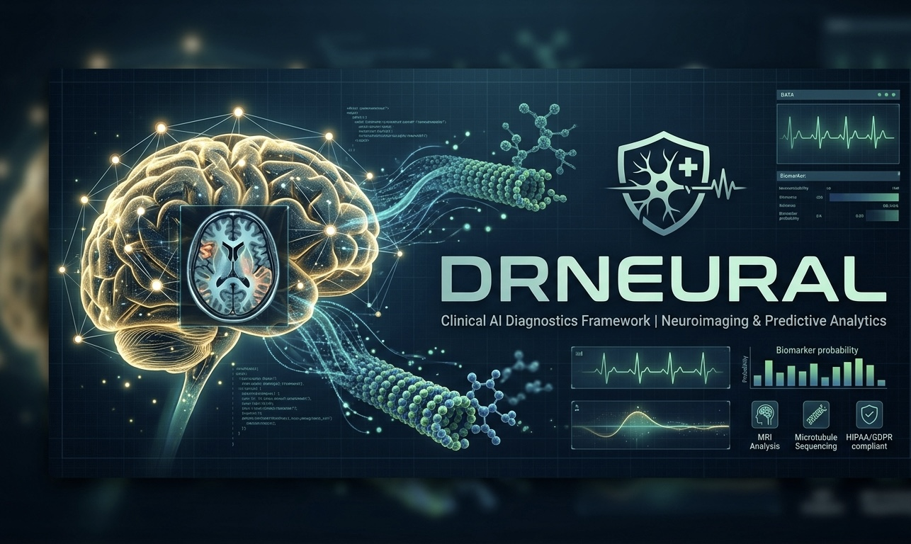

  

# 🩺 DrNeural.com | Clinical Diagnostic Engine

## 🔬 Project Vision
The **DrNeural** framework is designed to integrate advanced deep learning models into clinical diagnostic workflows. We are currently bridging the gap between classical neuroimaging and **Quantum Coherence** models for early-stage biomarker detection.

This repository serves as the centralized technical hub for the **DrNeural.com** infrastructure.

## 🚀 Key Technical Assets
* **NeuroCore-V1:** Specialized CNN architecture for high-resolution MRI and PET scan analysis.
* **Clinical-Bridge API:** Secure, encrypted data transmission protocol for HealthTech startups.
* **Predictive Diagnostics:** Early-stage pattern recognition for Parkinson’s and other neurological disorders.

## 🛠 Tech Stack & Integration
* **Languages:** Python 3.10+, CUDA for GPU acceleration.
* **Frameworks:** TensorFlow, PyTorch, SciKit-Learn.
* **Focus:** Real-time neural signal processing and microtubule-level data synthesis.

---

## 💼 Strategic Acquisition & Licensing
The **DrNeural.com** premium brand identity and its associated technical architecture are currently available for strategic acquisition or licensing. 

> [!IMPORTANT]
> **To secure the global brand rights and domain infrastructure, please proceed via the official secure transfer portal:**
> ### 🔗 [View DrNeural.com on Afternic (GoDaddy Brand)](https://www.afternic.com/domain/drneural.com)

---
© 2026 Neural Diagnostics HQ. All rights reserved.
